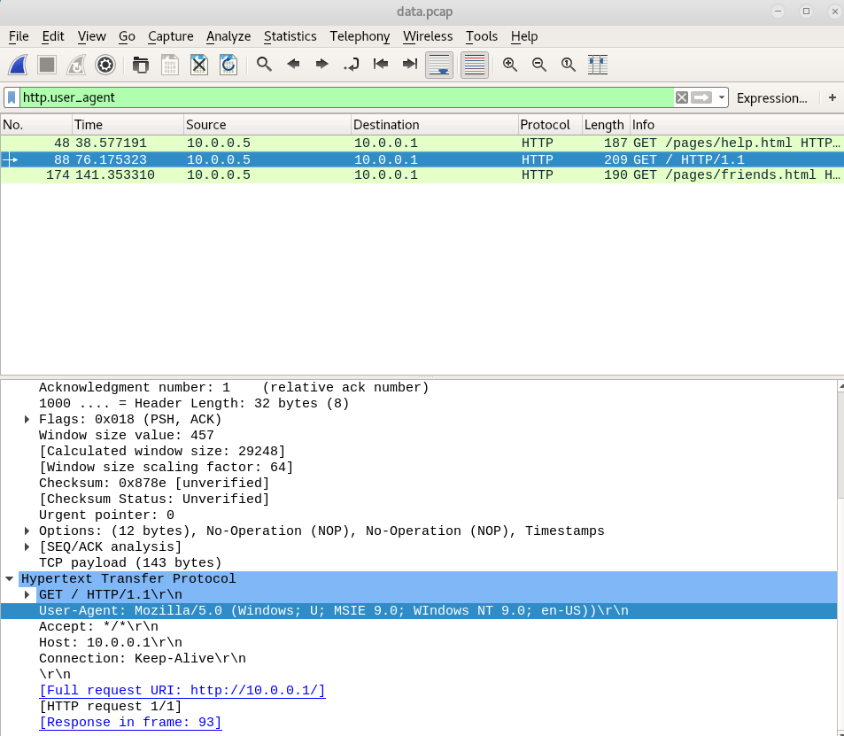

# Special Agent user

> We can get into the Administrator's computer with a browser exploit. But first, we need to figure out what browser they're using. Perhaps this information is located in a network packet capture we took: data.pcap. Enter the browser and version as "BrowserName BrowserVersion". NOTE: We're just looking for up to 3 levels of subversions for the browser version (ie. Version 1.2.3 for Version 1.2.3.4) and ignore any 0th subversions (ie. 1.2 for 1.2.0)

Open `data.pcap` in Wireshark, then filter `http.user_agent`

Search through results to find valid User Agent String.  Copy this string and paste into User-Agent Decoder:
    http://www.useragentstring.com./index.php

`User-Agent: Mozilla/5.0 (Windows; U; MSIE 9.0; WIndows NT 9.0; en-US))`

The browser version is `MSIE 9.0`

Enter browser result in picoCTF to get your 50 points.
